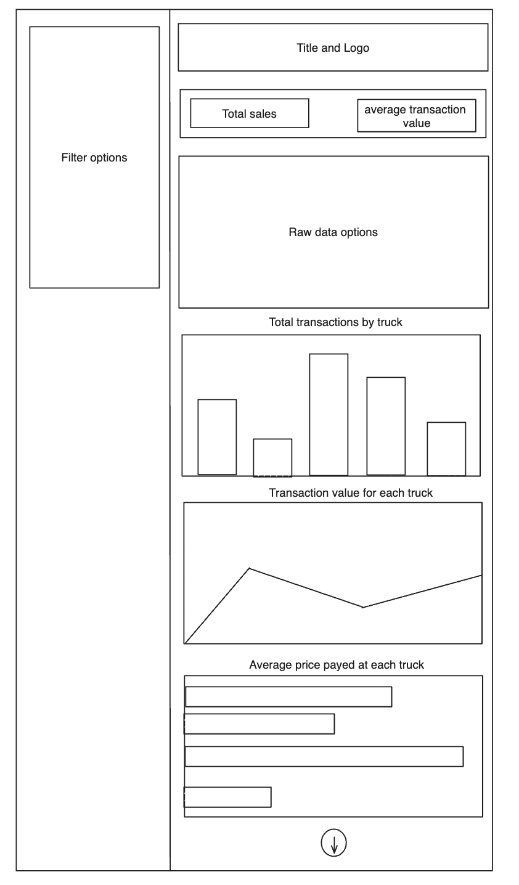
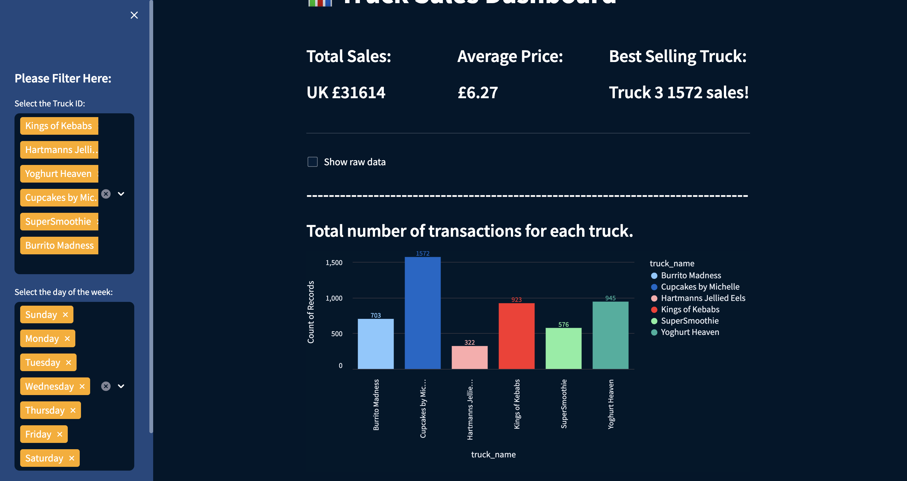
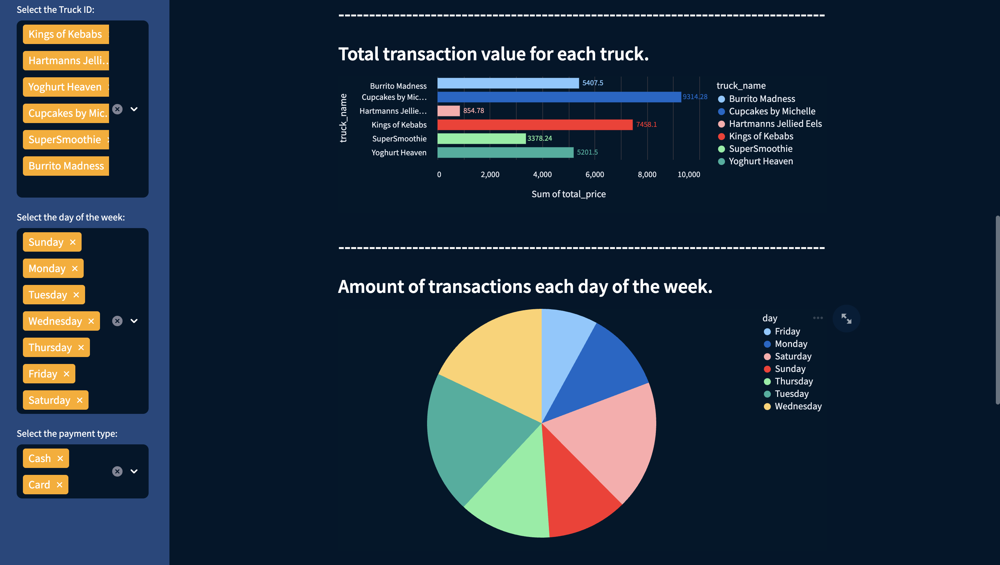
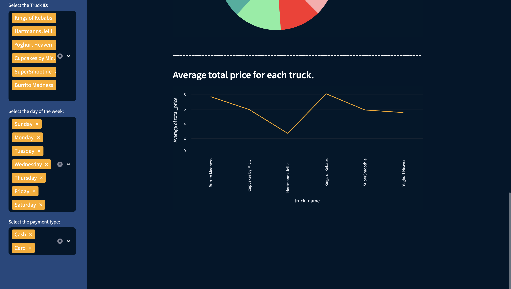

# Dashboard

This folder should contain all code and resources required for the dashboard.

# Dashboard Description

- This folder contains all the information needed to create a streamlit dashboard representing the data collected from the T3 trucks database.

## 🛠️ Getting Setup

.env keys used:
DATABASE_USERNAME = xxxxxxxx
DATABASE_PASSWORD = xxxxxxxx
DATABASE_IP = xxxxxxxxx
DATABASE_PORT = xxxxxxxx
DATABASE_NAME = xxxxxxxxx

## 🗂️ Files Explained

- `main.py`
    - A script to load the streamlit dashboard onto a webpage. Contains all design and calls to other files to fully implement the dashboard.
- `database.py`
    - This file contains all functions to connect to a redshift database and format the data so it becomes easy to manipulate and work with.
- `visuals.py`
    - This file contains all functions to create the charts and visuals shown on the dashboard.

## How to Run the streamlit Dashboard

- `streamlit run main.py`

## Wireframe

## Dashboard

